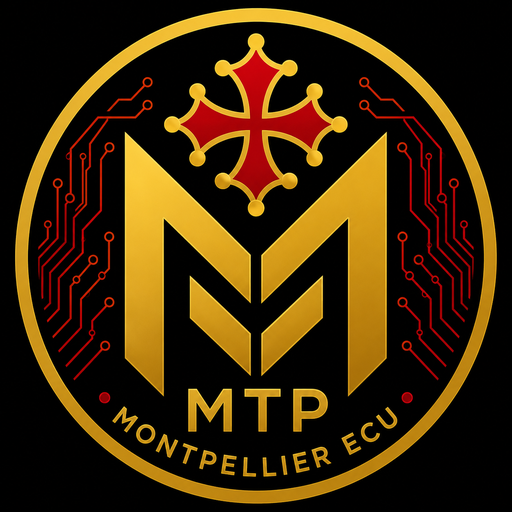

# Montpellier ECU (MTP)



## Née en Occitanie. Valable partout dans le monde.

Montpellier ECU (MTP) is an open-source cryptocurrency project deployed on the Base network.

The project combines regional identity with blockchain technology through transparency, public verification and open documentation.

---

# Blockchain Information

**Network:** Base

**Token Name:** Montpellier ECU

**Token Symbol:** MTP

**Smart Contract:**

```
0x50626097a780881d3dFf1Ff97579e6dAF965366B
```

**Explorer:**

https://basescan.org/token/0x50626097a780881d3dFf1Ff97579e6dAF965366B

**Trading:**

Available through Uniswap on the Base network.

---

# Documentation

📄 **White Paper**  
[Read the White Paper](docs/WHITEPAPER.md)

📊 **Tokenomics**  
[Read Tokenomics](docs/TOKENOMICS.md)

🗺 **Roadmap**  
[Read Roadmap](docs/ROADMAP.md)

🔍 **Transparency**  
[Read Transparency](docs/TRANSPARENCY.md)

🔐 **Security Information**  
[Read Security](docs/SECURITY.md)

---

# Project Vision

Montpellier ECU aims to create a transparent digital asset inspired by Montpellier and Occitanie heritage.

The project follows three fundamental principles:

- Transparency
- Open source development
- Long-term ecosystem growth

---

# Open Source Philosophy

All project documentation, visual identity resources and public information are available through this repository.

The objective is to allow users, platforms and community members to independently verify project information.

---

# Ecosystem

Montpellier ECU is designed to grow through:

- Blockchain transparency
- Community participation
- Public documentation
- Future ecosystem integrations

---

# Official Information

GitHub Repository:

https://github.com/jedi566666/MontpellierECU

Blockchain:

Base Network

Exchange:

Uniswap

---

# License

This project is published as an open-source project.

See the LICENSE file for details.
