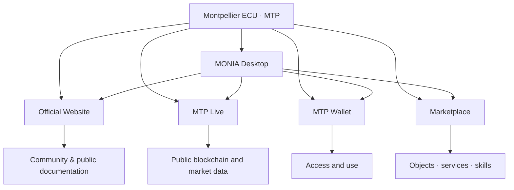

  

  <strong>An independent digital ecosystem built around Montpellier ECU (MTP) on Base.</strong>

  <a href="README_FR.md">Français</a> ·
  <a href="https://mtp-coin.netlify.app/">Official Website</a> ·
  <a href="https://mtplive.netlify.app/">MTP Live</a> ·
  <a href="https://mtpwallet.netlify.app/">MTP Wallet</a> ·
  <a href="https://t.me/MTPOCCITANIE">Telegram</a> ·
  <a href="https://x.com/JEDI566666">X</a>

  
  
  
  

---

## More than a token

Montpellier ECU is a progressively built digital ecosystem connecting a public token, market-monitoring tools, a wallet interface, a marketplace and a desktop application.

> **Give practical value back to overlooked objects, services and skills.**

MTP is not presented as a guaranteed investment, a savings product or a promise of market-price appreciation.

## Explore the ecosystem

<table>
<tr>
<td width="50%" valign="top">

<h3>Official Website</h3>

The public entry point for the MTP identity, ecosystem and official resources.

<a href="https://mtp-coin.netlify.app/"><strong>Open website →</strong></a>

</td>
<td width="50%" valign="top">

<h3>MTP Live</h3>

A dedicated terminal for market, blockchain, pools and ecosystem monitoring.

<a href="https://mtplive.netlify.app/"><strong>Open MTP Live →</strong></a>

</td>
</tr>
<tr>
<td width="50%" valign="top">

<h3>MTP Wallet</h3>

A streamlined interface designed around MTP access and everyday use.

<a href="https://mtpwallet.netlify.app/"><strong>Open wallet →</strong></a>

</td>
<td width="50%" valign="top">

<h3>MONIA Desktop</h3>

The official Windows desktop application bringing the MTP ecosystem into one interface.

<a href="../../releases"><strong>View releases →</strong></a>

</td>
</tr>
<tr>
<td colspan="2" valign="top">

<h3>MTP Marketplace</h3>

A marketplace for objects and services whose displayed and settled unit is Montpellier ECU.

<a href="https://mtp-coin.netlify.app/marketplace/"><strong>Open marketplace →</strong></a>

</td>
</tr>
</table>

## Canonical token reference

| Property | Value |
|---|---|
| Name | Montpellier ECU |
| Symbol | MTP |
| Network | Base |
| Standard | ERC-20 |
| Maximum supply | 21,000,000 MTP |
| Decimals | 18 |
| Contract | [`0x50626097a780881d3dFf1Ff97579e6dAF965366B`](https://basescan.org/token/0x50626097a780881d3dFf1Ff97579e6dAF965366B) |

Always verify the network and contract before interacting with the token.

## Current status

| Component | Status |
|---|---|
| ERC-20 contract on Base | Available |
| Official website | Available |
| MTP Live | Available |
| MTP Wallet | Available |
| Marketplace | Available |
| MONIA Windows application | Available |
| Public bilingual documentation | Available |
| Merchant network | In development |
| Advanced governance and staking | Exploratory — not launched |

## Documentation

| Strategy | Operations | Trust |
|---|---|---|
| [Vision](VISION.md) | [Ecosystem](ECOSYSTEM.md) | [Security](SECURITY.md) |
| [Roadmap](ROADMAP.md) | [Tokenomics](TOKENOMICS.md) | [Risk notice](RISK_NOTICE.md) |
| [Governance](GOVERNANCE.md) | [Liquidity](LIQUIDITY.md) | [FAQ](FAQ.md) |
| [French documentation](README_FR.md) | [Contributing](CONTRIBUTING.md) | [Code of conduct](CODE_OF_CONDUCT.md) |

## Architecture

```mermaid
flowchart TD
    MTP["Montpellier ECU · MTP"] --> SITE["Official Website"]
    MTP --> LIVE["MTP Live"]
    MTP --> WALLET["MTP Wallet"]
    MTP --> MARKET["Marketplace"]
    MTP --> MONIA["MONIA Desktop"]
    SITE --> COMMUNITY["Community & public documentation"]
    LIVE --> DATA["Public blockchain and market data"]
    WALLET --> USE["Access and use"]
    MARKET --> ECONOMY["Objects · services · skills"]
    MONIA --> SITE
    MONIA --> LIVE
    MONIA --> WALLET
    MONIA --> MARKET
```

## Development principles

- Build utility before hype.
- Separate released features from planned ideas.
- Keep public communication factual and non-misleading.
- Protect private security information.
- Publish documentation that can be reviewed and improved.
- Treat crypto-assets as risky and never promise returns.

---

  

<h3 align="center">Born in Occitania. Usable worldwide.</h3>

<strong>Every forgotten value can find its place again.</strong>

