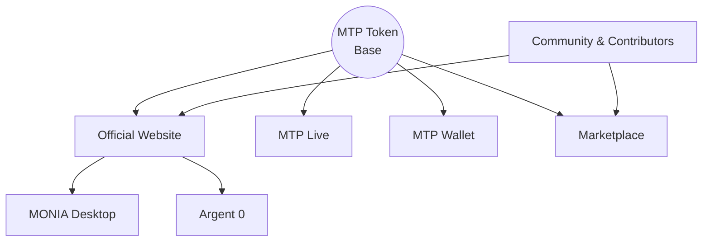

  

# MTP Master Plan

**Version 1.0 — Public strategy and development reference**

**Born in Occitania. Valid everywhere in the world.**

[Français](README_FR.md) · [Official website](https://mtp-coin.netlify.app/) · [MTP Live](https://mtplive.netlify.app/) · [MTP Wallet](https://mtpwallet.netlify.app/) · [Telegram](https://t.me/MTPOCCITANIE) · [X](https://x.com/JEDI566666)

---

## What is MTP?

Montpellier ECU (MTP) is an independent digital ecosystem built around an ERC-20 token deployed on Base. Its purpose is to give practical digital utility to objects, services and skills through a marketplace, wallet interfaces, network monitoring tools and user-facing software.

MTP is not presented as a guaranteed investment, a savings product or a promise of financial return. The project is developed openly, progressively and without venture-capital control.

> **Every forgotten value can find its place again.**

## Verified reference

| Item | Reference |
|---|---|
| Token | Montpellier ECU |
| Symbol | MTP |
| Network | Base |
| Contract | `0x50626097a780881d3dFf1Ff97579e6dAF965366B` |
| Maximum supply | 21,000,000 MTP |
| Decimals | 18 |
| Official website | https://mtp-coin.netlify.app/ |
| Source repositories | https://github.com/jedi566666 |

Always verify the contract address before interacting with the token. Links, interfaces and market venues may change; the Base contract remains the canonical technical identifier.

## Ecosystem at a glance

```mermaid
flowchart TB
    MTP((MTP Token<br/>Base))
    SITE[Official Website]
    LIVE[MTP Live]
    WALLET[MTP Wallet]
    MARKET[Marketplace]
    MONIA[MONIA Desktop]
    A0[Argent 0]
    COMMUNITY[Community & Contributors]

    MTP --> SITE
    MTP --> LIVE
    MTP --> WALLET
    MTP --> MARKET
    SITE --> MONIA
    SITE --> A0
    COMMUNITY --> SITE
    COMMUNITY --> MARKET
```

## Current status

| Component | Status | Purpose |
|---|---|---|
| MTP token on Base | **Live** | Core settlement and ecosystem asset |
| Official website | **Live** | Main public entry point |
| MTP Live | **Live** | Market and network monitoring interface |
| MTP Wallet | **Live / evolving** | Wallet-oriented access to the ecosystem |
| Marketplace | **Early operational stage** | Exchange of objects, services and skills in MTP |
| MONIA | **Version 1.0 available** | Portable desktop access to MTP services |
| Argent 0 | **Published concept** | Project philosophy: money is a means, not an end |
| Staking | **Not launched** | No public yield mechanism is currently promised |
| Governance | **Exploratory** | To be considered only after meaningful usage |

## Strategic priorities

The project follows three durable principles:

1. **Useful liquidity** — improve market accessibility without promising or engineering a price increase.
2. **Real utility** — make MTP usable for concrete exchanges, services and access.
3. **Strong, truthful narrative** — express the Occitan roots and independent character of the project without misleading claims.

The complete execution framework is available in [ROADMAP.md](ROADMAP.md).

## Documentation

- [Vision](VISION.md)
- [Roadmap](ROADMAP.md)
- [Ecosystem](ECOSYSTEM.md)
- [Token information](TOKENOMICS.md)
- [Liquidity principles](LIQUIDITY.md)
- [Security](SECURITY.md)
- [Governance principles](GOVERNANCE.md)
- [Risk notice](RISK_NOTICE.md)
- [Frequently asked questions](FAQ.md)
- [Contributing](CONTRIBUTING.md)
- [Changelog](CHANGELOG.md)

French versions are available with the `_FR` suffix.

## What MTP is not

- Not a guaranteed-return product.
- Not a promise that the token price will rise.
- Not a bank deposit or stable-value asset.
- Not a substitute for independent legal, tax or financial advice.
- Not a project whose credibility depends on hiding blockchain data or fabricating activity.

## Public-development rule

Every major feature should move through four states:

`Proposed → Built → Tested → Publicly documented`

Planned features must never be presented as already available.

## Licence

The documentation in this repository is published under the [Creative Commons Attribution 4.0 International licence](LICENSE). Project names, logos and trademarks remain the property of their respective owner.
