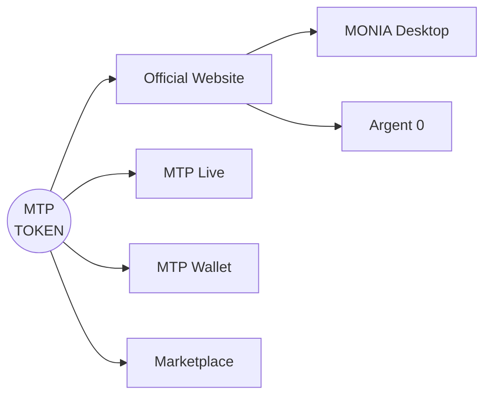

<div align="center">


<br>

[](https://basescan.org/token/0x50626097a780881d3dFf1Ff97579e6dAF965366B)
[](https://basescan.org/token/0x50626097a780881d3dFf1Ff97579e6dAF965366B)
[](#documentation)
[](CHANGELOG.md)

**The official public repository of the Montpellier ECU digital ecosystem.**

[Website](https://mtp-coin.netlify.app/) · [MTP Live](https://mtplive.netlify.app/) · [MTP Wallet](https://mtpwallet.netlify.app/) · [MONIA](https://github.com/jedi566666/MontpellierECU/releases) · [Telegram](https://t.me/MTPOCCITANIE) · [X](https://x.com/JEDI566666)

[**Lire en français**](README_FR.md)

</div>

---

## A digital ecosystem — not just a token

**Montpellier ECU (MTP)** is an independent digital ecosystem built around an ERC-20 token deployed on **Base**. It connects a token, public tools and user-facing services around one objective:

> **Give practical value back to objects, services and skills that are overlooked or underused.**

MTP is built progressively, publicly and without venture-capital control. It is not presented as a guaranteed investment, a savings product or a promise that its market price will rise.

## Canonical token reference

| Property | Value |
|---|---|
| **Name** | Montpellier ECU |
| **Symbol** | MTP |
| **Network** | Base |
| **Standard** | ERC-20 |
| **Contract** | [`0x50626097a780881d3dFf1Ff97579e6dAF965366B`](https://basescan.org/token/0x50626097a780881d3dFf1Ff97579e6dAF965366B) |
| **Maximum supply** | 21,000,000 MTP |
| **Decimals** | 18 |

> [!IMPORTANT]
> Always verify the complete contract address before interacting with MTP. Websites, interfaces and trading venues may change; the Base contract above is the canonical technical identifier.

## Ecosystem


```mermaid
flowchart LR
    MTP((MTP<br/>TOKEN))
    SITE[Official Website]
    LIVE[MTP Live]
    WALLET[MTP Wallet]
    MARKET[Marketplace]
    MONIA[MONIA Desktop]
    ZERO[Argent 0]

    MTP --> SITE
    MTP --> LIVE
    MTP --> WALLET
    MTP --> MARKET
    SITE --> MONIA
    SITE --> ZERO
```

| Component | Status | Role |
|---|---:|---|
| **MTP token** | Live | Core digital asset of the ecosystem |
| **Official website** | Live | Main public entry point |
| **MTP Live** | Live | Market and network monitoring |
| **MTP Wallet** | Live / evolving | Wallet-oriented ecosystem access |
| **Marketplace** | Early operational stage | Objects, services and skills exchanged in MTP |
| **MONIA Desktop** | v1.0 available | Portable Windows access to MTP services |
| **Argent 0** | Published concept | “Money is a means, not an end.” |
| **Staking** | Not launched | No public yield mechanism is promised |
| **Governance** | Exploratory | Considered only after meaningful usage |

## Strategic doctrine

MTP develops around three durable principles:

1. **Useful liquidity** — improve market accessibility without engineering or promising a price increase.
2. **Real utility** — make MTP usable for concrete exchanges, services and digital access.
3. **A strong, truthful identity** — preserve its Occitan roots and independent character without misleading claims.

The public execution framework is documented in the [MTP Roadmap](ROADMAP.md).

## Documentation

| Area | English | Français |
|---|---|---|
| Vision | [VISION.md](VISION.md) | [VISION_FR.md](VISION_FR.md) |
| Roadmap | [ROADMAP.md](ROADMAP.md) | [ROADMAP_FR.md](ROADMAP_FR.md) |
| Ecosystem | [ECOSYSTEM.md](ECOSYSTEM.md) | [ECOSYSTEM_FR.md](ECOSYSTEM_FR.md) |
| Token information | [TOKENOMICS.md](TOKENOMICS.md) | [TOKENOMICS_FR.md](TOKENOMICS_FR.md) |
| Liquidity principles | [LIQUIDITY.md](LIQUIDITY.md) | [LIQUIDITY_FR.md](LIQUIDITY_FR.md) |
| Security | [SECURITY.md](SECURITY.md) | [SECURITY_FR.md](SECURITY_FR.md) |
| Governance | [GOVERNANCE.md](GOVERNANCE.md) | [GOVERNANCE_FR.md](GOVERNANCE_FR.md) |
| Risk notice | [RISK_NOTICE.md](RISK_NOTICE.md) | [RISK_NOTICE_FR.md](RISK_NOTICE_FR.md) |
| FAQ | [FAQ.md](FAQ.md) | [FAQ_FR.md](FAQ_FR.md) |
| Contributing | [CONTRIBUTING.md](CONTRIBUTING.md) | [CONTRIBUTING_FR.md](CONTRIBUTING_FR.md) |

## Public-development rule

Every major feature should move through four visible states:

```text
PROPOSED  →  BUILT  →  TESTED  →  PUBLICLY DOCUMENTED
```

Planned capabilities must never be presented as already available.

## What MTP is not

- Not a guaranteed-return product.
- Not a promise that the token price will rise.
- Not a bank deposit or stable-value asset.
- Not a substitute for independent legal, tax or financial advice.
- Not a project whose credibility depends on fabricated activity or hidden risk.

## Participate responsibly

Review the [contribution guide](CONTRIBUTING.md), report security concerns according to the [security policy](SECURITY.md), and read the [risk notice](RISK_NOTICE.md) before interacting with crypto-assets or liquidity pools.

## Licence

Documentation is published under the [Creative Commons Attribution 4.0 International licence](LICENSE). Project names, logos and trademarks remain the property of their respective owner.

---

<div align="center">

**Born in Occitania. Valid everywhere in the world.**

*Every forgotten value can find its place again.*

</div>
