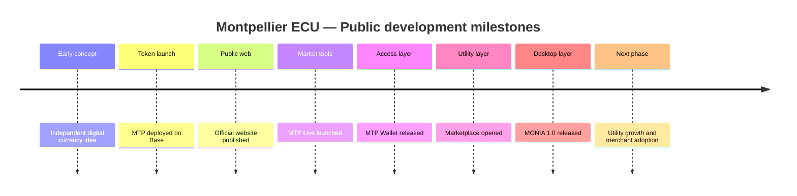
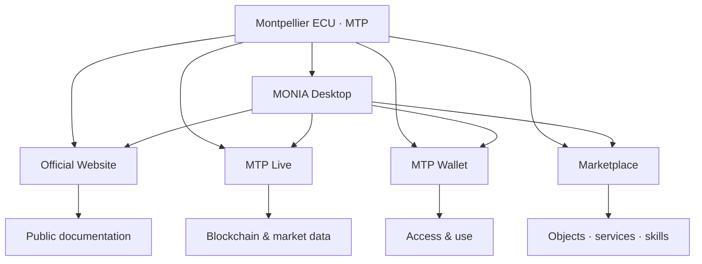

  

  <strong>An independent digital ecosystem built around Montpellier ECU (MTP) on Base.</strong>

  <a href="README_FR.md">Français</a> ·
  <a href="https://mtptoken.pages.dev/">Official Website</a> ·
  <a href="https://mtptoken.pages.dev/live/">MTP Live</a> ·
  <a href="https://mtptoken.pages.dev/wallet/">MTP Wallet</a> ·
  <a href="https://mtptoken.pages.dev/echanges/">Marketplace</a> ·
  <a href="https://t.me/MTPOCCITANIE">Telegram</a> ·
  <a href="https://x.com/JEDI566666">X</a>

  
  
  
  

---

## Technical update — 22 September 2026

The official contract has been independently recompiled: full runtime and creation bytecode match. Fixed supply: 21 million MTP, 18 decimals. This is not a comprehensive security audit.

[Contract evidence (FR)](docs/preuves-contrat-2026-09-22/RAPPORT.md) · [Current website capabilities (FR)](docs/ETAT-DU-SITE.md) · [Zero-budget utility proposal (FR)](docs/PISTE-UTILITE-ARGENT-0.md)

Wallet currently reads balances; listings remain local drafts. The Live chart displays dated source data, not guaranteed real-time trades. Monia 2.0.0 is a local delivery, not a confirmed public release. Older documents and images may describe previous versions; the dated technical documentation above takes precedence for this reconstruction.

## Why MTP?

MTP was created to connect a public token with practical, visible and progressively developed tools.

- **Local identity:** born in Montpellier and rooted in Occitania.
- **Concrete utility:** marketplace, wallet access, monitoring and desktop software.
- **Independent development:** no venture-capital control and no promise of financial return.
- **Public documentation:** strategy, risks, security, liquidity and roadmap are openly documented.

> **Give practical value back to overlooked objects, services and skills.**

## Explore the ecosystem

<table>
<tr>
<td width="50%" valign="top">

<h3>Official Website</h3>

The public entry point for the MTP identity, ecosystem and official resources.

<a href="https://mtptoken.pages.dev/"><strong>Open website →</strong></a>

</td>
<td width="50%" valign="top">

<h3>MTP Live</h3>

A dedicated terminal for market, blockchain, pools and ecosystem monitoring.

<a href="https://mtptoken.pages.dev/live/"><strong>Open MTP Live →</strong></a>

</td>
</tr>
<tr>
<td width="50%" valign="top">

<h3>MTP Wallet</h3>

A streamlined interface designed around MTP access and everyday use.

<a href="https://mtptoken.pages.dev/wallet/"><strong>Open wallet →</strong></a>

</td>
<td width="50%" valign="top">

<h3>MONIA Desktop</h3>

The official Windows desktop application bringing the ecosystem into one interface.

<a href="https://github.com/jedi566666/MontpellierECU/releases"><strong>View releases →</strong></a>

</td>
</tr>
<tr>
<td colspan="2" valign="top">

<h3>MTP Marketplace</h3>

Local listing drafts for objects and services; manual sharing, no automatic publication or payment.

<a href="https://mtptoken.pages.dev/echanges/"><strong>Open marketplace →</strong></a>

</td>
</tr>
</table>

## Project timeline

```mermaid
timeline
    title Montpellier ECU — Public development milestones
    Early concept : Independent digital currency idea
    Token launch : MTP deployed on Base
    Public web : Official website published
    Market tools : MTP Live launched
    Access layer : MTP Wallet released
    Utility layer : Marketplace opened
    Desktop layer : MONIA 1.0 released
    Next phase : Utility growth and merchant adoption
```

## Architecture

```mermaid
flowchart TD
    MTP["Montpellier ECU · MTP"] --> SITE["Official Website"]
    MTP --> LIVE["MTP Live"]
    MTP --> WALLET["MTP Wallet"]
    MTP --> MARKET["Marketplace"]
    MTP --> MONIA["MONIA Desktop"]
    SITE --> DOCS["Public documentation"]
    LIVE --> DATA["Blockchain & market data"]
    WALLET --> ACCESS["Access & use"]
    MARKET --> ECONOMY["Objects · services · skills"]
    MONIA --> SITE
    MONIA --> LIVE
    MONIA --> WALLET
    MONIA --> MARKET
```

## Current status

| Component | Status |
|---|---|
| ERC-20 contract on Base | Available |
| Official website | Available |
| MTP Live | Available |
| MTP Wallet | Available |
| Marketplace | Available |
| MONIA Windows application | Available |
| Public bilingual documentation | Available |
| Merchant network | In development |
| Advanced governance and staking | Exploratory — not launched |

## Latest public releases

| Release | Purpose | Access |
|---|---|---|
| MONIA 1.0 | Official Windows application | [GitHub Releases](https://github.com/jedi566666/MontpellierECU/releases) |
| Official Website V10.3 | Public ecosystem entry point | [Open](https://mtptoken.pages.dev/) |
| MTP Live V7 | Monitoring terminal | [Open](https://mtptoken.pages.dev/live/) |
| MTP Wallet | Wallet interface | [Open](https://mtptoken.pages.dev/wallet/) |
| Marketplace | Objects and services in MTP | [Open](https://mtptoken.pages.dev/echanges/) |

## Canonical token reference

| Property | Value |
|---|---|
| Name | Montpellier ECU |
| Symbol | MTP |
| Network | Base |
| Standard | ERC-20 |
| Maximum supply | 21,000,000 MTP |
| Decimals | 18 |
| Contract | [`0x50626097a780881d3dFf1Ff97579e6dAF965366B`](https://basescan.org/token/0x50626097a780881d3dFf1Ff97579e6dAF965366B) |

Always verify the network and contract before interacting with the token.

## Documentation

| Strategy | Operations | Trust |
|---|---|---|
| [Vision](VISION.md) | [Ecosystem](ECOSYSTEM.md) | [Security](SECURITY.md) |
| [Roadmap](ROADMAP.md) | [Tokenomics](TOKENOMICS.md) | [Risk notice](RISK_NOTICE.md) |
| [Governance](GOVERNANCE.md) | [Liquidity](LIQUIDITY.md) | [FAQ](FAQ.md) |
| [French documentation](README_FR.md) | [Contributing](CONTRIBUTING.md) | [Code of conduct](CODE_OF_CONDUCT.md) |
| [Acknowledgements](ACKNOWLEDGEMENTS.md) | [Changelog](CHANGELOG.md) | [License](LICENSE) |

## Development principles

- Build utility before hype.
- Separate released features from planned ideas.
- Keep public communication factual and non-misleading.
- Protect private security information.
- Publish documentation that can be reviewed and improved.
- Treat crypto-assets as risky and never promise returns.

## Acknowledgements

The project thanks the teams at OpenAI for creating ChatGPT, as well as the open-source communities and platforms that made its development possible. These acknowledgements do not imply partnership, endorsement or affiliation. [Read the full acknowledgements →](ACKNOWLEDGEMENTS.md)

<em>Built independently with the support of open-source technologies and AI-assisted development tools.</em>

  

