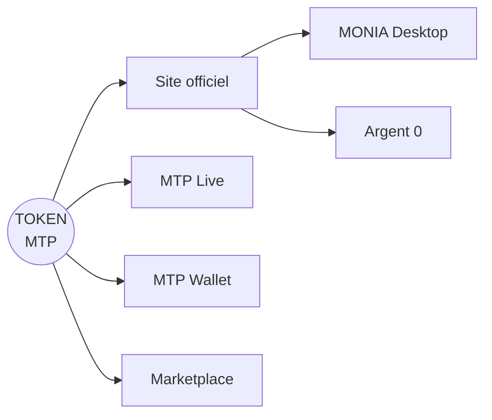

<div align="center">


<br>

[](https://basescan.org/token/0x50626097a780881d3dFf1Ff97579e6dAF965366B)
[](https://basescan.org/token/0x50626097a780881d3dFf1Ff97579e6dAF965366B)
[](#documentation)
[](CHANGELOG.md)

**Le dépôt public officiel de l’écosystème numérique Montpellier ECU.**

[Site officiel](https://mtp-coin.netlify.app/) · [MTP Live](https://mtplive.netlify.app/) · [MTP Wallet](https://mtpwallet.netlify.app/) · [MONIA](https://github.com/jedi566666/MontpellierECU/releases) · [Telegram](https://t.me/MTPOCCITANIE) · [X](https://x.com/JEDI566666)

[**Read in English**](README.md)

</div>

---

## Un écosystème numérique — pas seulement un token

**Montpellier ECU (MTP)** est un écosystème numérique indépendant construit autour d’un token ERC-20 déployé sur **Base**. Il rassemble un token, des outils publics et des services destinés aux utilisateurs autour d’un objectif :

> **Redonner une valeur d’usage aux objets, aux services et aux savoir-faire oubliés ou sous-utilisés.**

MTP se développe progressivement, publiquement et sans contrôle d’un fonds de capital-risque. Il n’est pas présenté comme un investissement garanti, un produit d’épargne ou une promesse de hausse de son prix de marché.

## Référence canonique du token

| Propriété | Valeur |
|---|---|
| **Nom** | Montpellier ECU |
| **Symbole** | MTP |
| **Réseau** | Base |
| **Standard** | ERC-20 |
| **Contrat** | [`0x50626097a780881d3dFf1Ff97579e6dAF965366B`](https://basescan.org/token/0x50626097a780881d3dFf1Ff97579e6dAF965366B) |
| **Offre maximale** | 21 000 000 MTP |
| **Décimales** | 18 |

> [!IMPORTANT]
> Vérifiez toujours l’adresse complète du contrat avant toute interaction avec MTP. Les sites, interfaces et plateformes peuvent évoluer ; le contrat Base ci-dessus reste l’identifiant technique canonique.

## Écosystème



| Composant | Statut | Rôle |
|---|---:|---|
| **Token MTP** | En ligne | Actif numérique central de l’écosystème |
| **Site officiel** | En ligne | Point d’entrée public principal |
| **MTP Live** | En ligne | Suivi du marché et du réseau |
| **MTP Wallet** | En ligne / évolutif | Accès à l’écosystème orienté wallet |
| **Marketplace** | Première phase opérationnelle | Objets, services et savoir-faire échangés en MTP |
| **MONIA Desktop** | v1.0 disponible | Accès Windows portable aux services MTP |
| **Argent 0** | Concept publié | « L’argent est un moyen, pas une fin. » |
| **Staking** | Non lancé | Aucun mécanisme public de rendement n’est promis |
| **Gouvernance** | Exploratoire | Envisagée après l’apparition d’un usage significatif |

## Doctrine stratégique

MTP se développe autour de trois principes durables :

1. **Liquidité utile** — améliorer l’accessibilité du marché sans fabriquer ni promettre une hausse du prix.
2. **Utilité réelle** — rendre le MTP utilisable pour des échanges, des services et des accès numériques concrets.
3. **Identité forte et honnête** — préserver les racines occitanes et l’indépendance du projet sans affirmation trompeuse.

Le cadre public d’exécution est détaillé dans la [feuille de route MTP](ROADMAP_FR.md).

## Documentation

| Domaine | Français | English |
|---|---|---|
| Vision | [VISION_FR.md](VISION_FR.md) | [VISION.md](VISION.md) |
| Feuille de route | [ROADMAP_FR.md](ROADMAP_FR.md) | [ROADMAP.md](ROADMAP.md) |
| Écosystème | [ECOSYSTEM_FR.md](ECOSYSTEM_FR.md) | [ECOSYSTEM.md](ECOSYSTEM.md) |
| Informations sur le token | [TOKENOMICS_FR.md](TOKENOMICS_FR.md) | [TOKENOMICS.md](TOKENOMICS.md) |
| Principes de liquidité | [LIQUIDITY_FR.md](LIQUIDITY_FR.md) | [LIQUIDITY.md](LIQUIDITY.md) |
| Sécurité | [SECURITY_FR.md](SECURITY_FR.md) | [SECURITY.md](SECURITY.md) |
| Gouvernance | [GOVERNANCE_FR.md](GOVERNANCE_FR.md) | [GOVERNANCE.md](GOVERNANCE.md) |
| Avertissement sur les risques | [RISK_NOTICE_FR.md](RISK_NOTICE_FR.md) | [RISK_NOTICE.md](RISK_NOTICE.md) |
| FAQ | [FAQ_FR.md](FAQ_FR.md) | [FAQ.md](FAQ.md) |
| Contribution | [CONTRIBUTING_FR.md](CONTRIBUTING_FR.md) | [CONTRIBUTING.md](CONTRIBUTING.md) |

## Règle de développement public

Chaque fonction importante doit traverser quatre états visibles :

```text
PROPOSÉE  →  CONSTRUITE  →  TESTÉE  →  DOCUMENTÉE PUBLIQUEMENT
```

Une fonction prévue ne doit jamais être présentée comme déjà disponible.

## Ce que MTP n’est pas

- Pas un produit à rendement garanti.
- Pas une promesse de hausse du prix du token.
- Pas un dépôt bancaire ni un actif à valeur stable.
- Pas un substitut à un avis juridique, fiscal ou financier indépendant.
- Pas un projet dont la crédibilité dépendrait d’une activité fabriquée ou d’un risque dissimulé.

## Participer de manière responsable

Consultez le [guide de contribution](CONTRIBUTING_FR.md), signalez les problèmes de sécurité conformément à la [politique de sécurité](SECURITY_FR.md) et lisez l’[avertissement sur les risques](RISK_NOTICE_FR.md) avant toute interaction avec des crypto-actifs ou des pools de liquidité.

## Licence

La documentation est publiée sous [licence Creative Commons Attribution 4.0 International](LICENSE). Les noms du projet, logos et marques restent la propriété de leur détenteur.

---

<div align="center">

**Née en Occitanie. Valable partout dans le monde.**

*Toute valeur oubliée peut retrouver sa place.*

</div>
