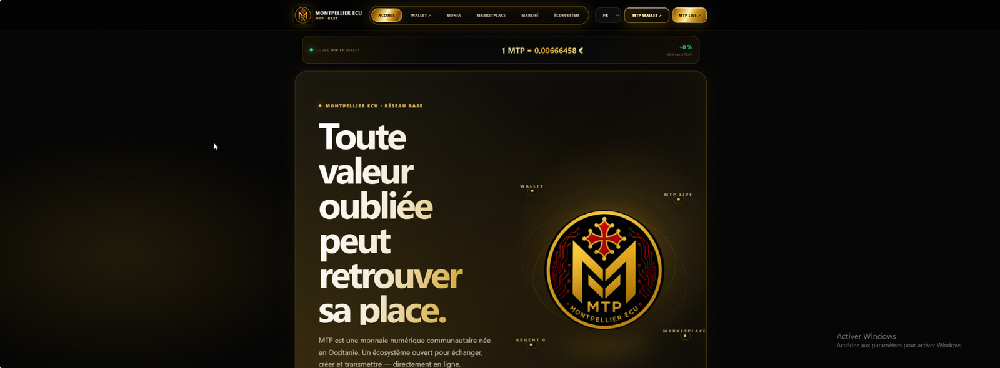
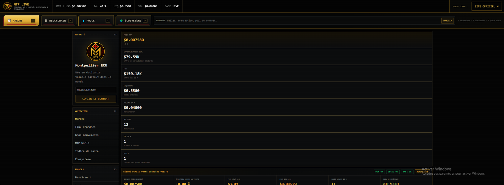
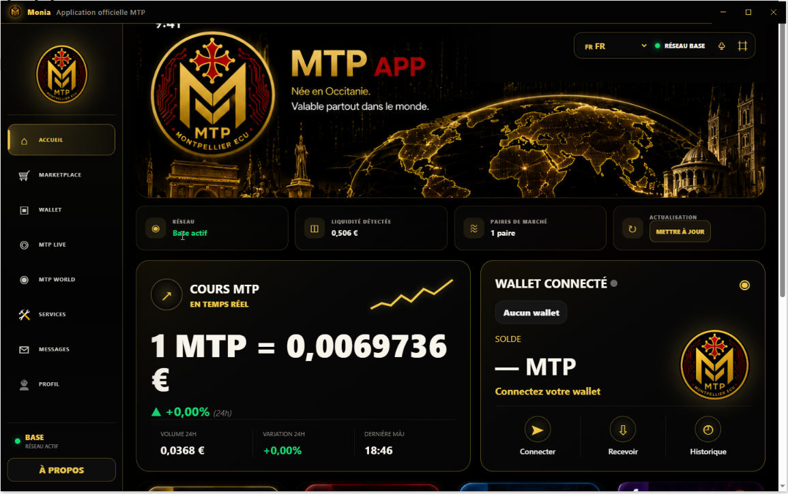
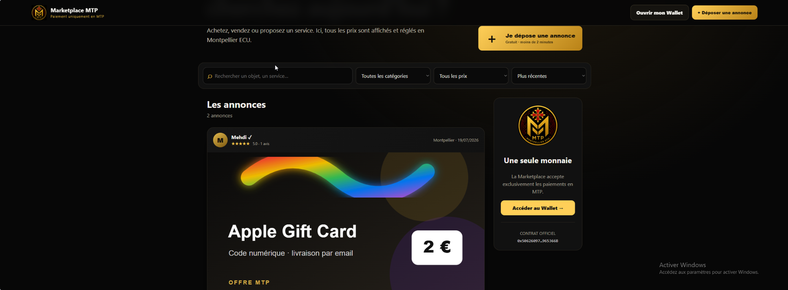
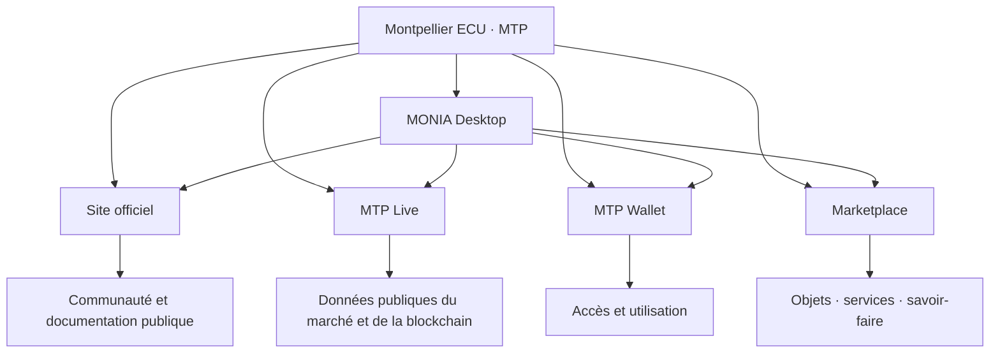
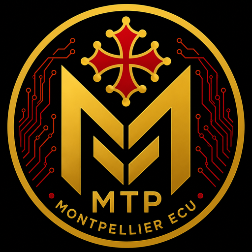

  

  <strong>Un écosystème numérique indépendant construit autour de Montpellier ECU (MTP) sur Base.</strong>

  <a href="README.md">English</a> ·
  <a href="https://mtp-coin.netlify.app/">Site officiel</a> ·
  <a href="https://mtplive.netlify.app/">MTP Live</a> ·
  <a href="https://mtpwallet.netlify.app/">MTP Wallet</a> ·
  <a href="https://t.me/MTPOCCITANIE">Telegram</a> ·
  <a href="https://x.com/JEDI566666">X</a>

  
  
  
  

---

## Plus qu’un token

Montpellier ECU est un écosystème numérique construit progressivement autour d’un token public, d’outils de suivi du marché, d’une interface Wallet, d’une Marketplace et d’une application Windows.

> **Redonner une valeur d’usage aux objets, aux services et aux savoir-faire oubliés ou sous-utilisés.**

MTP n’est pas présenté comme un placement garanti, un produit d’épargne ou une promesse d’augmentation du cours.

## Explorer l’écosystème

<table>
<tr>
<td width="50%" valign="top">

<h3>Site officiel</h3>

Le point d’entrée public vers l’identité, l’écosystème et les ressources officielles de MTP.

<a href="https://mtp-coin.netlify.app/"><strong>Ouvrir le site →</strong></a>

</td>
<td width="50%" valign="top">

<h3>MTP Live</h3>

Un terminal dédié au suivi du marché, de la blockchain, des pools et de l’écosystème.

<a href="https://mtplive.netlify.app/"><strong>Ouvrir MTP Live →</strong></a>

</td>
</tr>
<tr>
<td width="50%" valign="top">

<h3>MTP Wallet</h3>

Une interface simplifiée conçue autour de l’accès au MTP et de son utilisation quotidienne.

<a href="https://mtpwallet.netlify.app/"><strong>Ouvrir le Wallet →</strong></a>

</td>
<td width="50%" valign="top">

<h3>MONIA Desktop</h3>

L’application Windows officielle qui rassemble l’écosystème MTP dans une seule interface.

<a href="https://github.com/jedi566666/MontpellierECU/releases"><strong>Voir les versions →</strong></a>

</td>
</tr>
<tr>
<td colspan="2" valign="top">

<h3>Marketplace MTP</h3>

Une place de marché dédiée aux objets et services dont l’unité affichée et réglée est Montpellier ECU.

<a href="https://mtp-coin.netlify.app/marketplace/"><strong>Ouvrir la Marketplace →</strong></a>

</td>
</tr>
</table>

## Référence canonique du token

| Propriété | Valeur |
|---|---|
| Nom | Montpellier ECU |
| Symbole | MTP |
| Réseau | Base |
| Standard | ERC-20 |
| Offre maximale | 21 000 000 MTP |
| Décimales | 18 |
| Contrat | [`0x50626097a780881d3dFf1Ff97579e6dAF965366B`](https://basescan.org/token/0x50626097a780881d3dFf1Ff97579e6dAF965366B) |

Toujours vérifier le réseau et le contrat avant toute interaction avec le token.

## État actuel

| Composant | État |
|---|---|
| Contrat ERC-20 sur Base | Disponible |
| Site officiel | Disponible |
| MTP Live | Disponible |
| MTP Wallet | Disponible |
| Marketplace | Disponible |
| Application Windows MONIA | Disponible |
| Documentation publique bilingue | Disponible |
| Réseau de commerçants | En développement |
| Gouvernance avancée et staking | Exploratoires — non lancés |

## Documentation

| Stratégie | Fonctionnement | Confiance |
|---|---|---|
| [Vision](VISION_FR.md) | [Écosystème](ECOSYSTEM_FR.md) | [Sécurité](SECURITY_FR.md) |
| [Roadmap](ROADMAP_FR.md) | [Tokenomics](TOKENOMICS_FR.md) | [Avertissement sur les risques](RISK_NOTICE_FR.md) |
| [Gouvernance](GOVERNANCE_FR.md) | [Liquidité](LIQUIDITY_FR.md) | [FAQ](FAQ_FR.md) |
| [Documentation anglaise](README.md) | [Contribuer](CONTRIBUTING_FR.md) | [Code de conduite](CODE_OF_CONDUCT.md) |

## Architecture

## Principes de développement

- Construire l’utilité avant le bruit médiatique.
- Distinguer les fonctions disponibles des idées prévues.
- Maintenir une communication factuelle et non trompeuse.
- Protéger les informations privées liées à la sécurité.
- Publier une documentation vérifiable et améliorable.
- Considérer les crypto-actifs comme risqués et ne jamais promettre de rendement.

---

  

<h3 align="center">Née en Occitanie. Valable partout dans le monde.</h3>

<strong>Toute valeur oubliée peut retrouver sa place.</strong>

