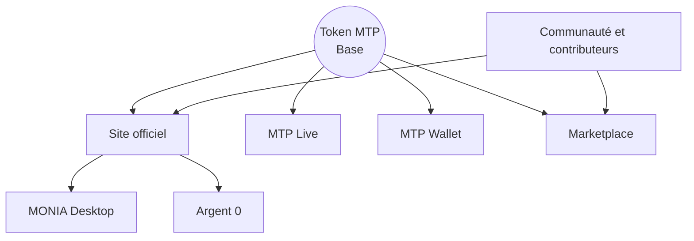

  

# MTP Master Plan

**Version 1.0 — Référence publique de stratégie et de développement**

**Née en Occitanie. Valable partout dans le monde.**

[English](README.md) · [Site officiel](https://mtp-coin.netlify.app/) · [MTP Live](https://mtplive.netlify.app/) · [MTP Wallet](https://mtpwallet.netlify.app/) · [Telegram](https://t.me/MTPOCCITANIE) · [X](https://x.com/JEDI566666)

---

## Qu’est-ce que MTP ?

Montpellier ECU (MTP) est un écosystème numérique indépendant construit autour d’un token ERC-20 déployé sur Base. Son objectif est de donner une utilité numérique concrète aux objets, aux services et aux savoir-faire grâce à une marketplace, des interfaces de wallet, des outils de suivi du réseau et des logiciels accessibles aux utilisateurs.

MTP n’est pas présenté comme un investissement garanti, un produit d’épargne ou une promesse de rendement financier. Le projet se développe publiquement, progressivement et sans contrôle d’un fonds de capital-risque.

> **Toute valeur oubliée peut retrouver sa place.**

## Référence vérifiable

| Élément | Référence |
|---|---|
| Token | Montpellier ECU |
| Symbole | MTP |
| Réseau | Base |
| Contrat | `0x50626097a780881d3dFf1Ff97579e6dAF965366B` |
| Offre maximale | 21 000 000 MTP |
| Décimales | 18 |
| Site officiel | https://mtp-coin.netlify.app/ |
| Dépôts sources | https://github.com/jedi566666 |

Vérifiez toujours l’adresse du contrat avant toute interaction. Les liens, interfaces et lieux de marché peuvent évoluer ; le contrat Base reste l’identifiant technique canonique.

## Vue d’ensemble de l’écosystème

## État actuel

| Composant | Statut | Fonction |
|---|---|---|
| Token MTP sur Base | **En ligne** | Actif central et moyen d’échange de l’écosystème |
| Site officiel | **En ligne** | Point d’entrée public principal |
| MTP Live | **En ligne** | Interface de suivi du marché et du réseau |
| MTP Wallet | **En ligne / évolutif** | Accès orienté wallet à l’écosystème |
| Marketplace | **Première phase opérationnelle** | Échange d’objets, de services et de savoir-faire en MTP |
| MONIA | **Version 1.0 disponible** | Accès portable aux services MTP sur ordinateur |
| Argent 0 | **Concept publié** | Philosophie : l’argent est un moyen, pas une fin |
| Staking | **Non lancé** | Aucun mécanisme public de rendement n’est promis |
| Gouvernance | **Exploratoire** | À envisager seulement après l’apparition d’un usage significatif |

## Priorités stratégiques

Le projet repose sur trois principes durables :

1. **Liquidité utile** — améliorer l’accessibilité du marché sans promettre ni fabriquer une hausse du prix.
2. **Utilité réelle** — permettre l’emploi concret du MTP pour des échanges, des services et des accès.
3. **Narratif fort et honnête** — exprimer les racines occitanes et l’indépendance du projet sans affirmation trompeuse.

Le cadre d’exécution complet figure dans [ROADMAP_FR.md](ROADMAP_FR.md).

## Documentation

- [Vision](VISION_FR.md)
- [Feuille de route](ROADMAP_FR.md)
- [Écosystème](ECOSYSTEM_FR.md)
- [Informations sur le token](TOKENOMICS_FR.md)
- [Principes de liquidité](LIQUIDITY_FR.md)
- [Sécurité](SECURITY_FR.md)
- [Principes de gouvernance](GOVERNANCE_FR.md)
- [Avertissement sur les risques](RISK_NOTICE_FR.md)
- [Questions fréquentes](FAQ_FR.md)
- [Contribuer](CONTRIBUTING_FR.md)
- [Historique](CHANGELOG.md)

## Ce que MTP n’est pas

- Pas un produit à rendement garanti.
- Pas une promesse de hausse du cours.
- Pas un dépôt bancaire ni un actif à valeur stable.
- Pas un substitut à un avis juridique, fiscal ou financier indépendant.
- Pas un projet dont la crédibilité reposerait sur la dissimulation des données blockchain ou la fabrication d’activité.

## Règle de développement public

Chaque fonction importante doit passer par quatre états :

`Proposée → Construite → Testée → Documentée publiquement`

Une fonction prévue ne doit jamais être présentée comme déjà disponible.

## Licence

La documentation de ce dépôt est publiée sous [licence Creative Commons Attribution 4.0 International](LICENSE). Les noms du projet, logos et marques restent la propriété de leur détenteur.
