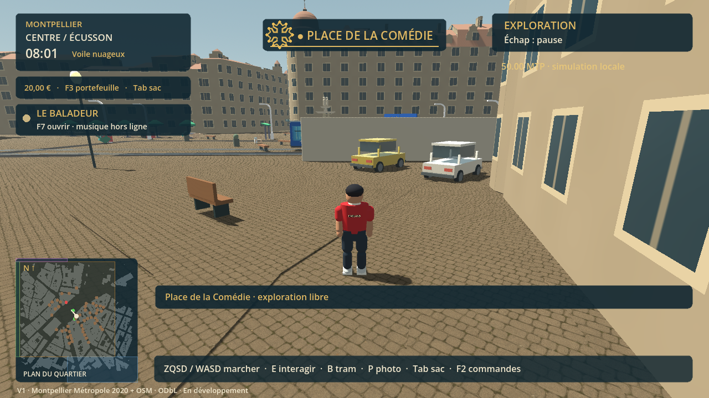
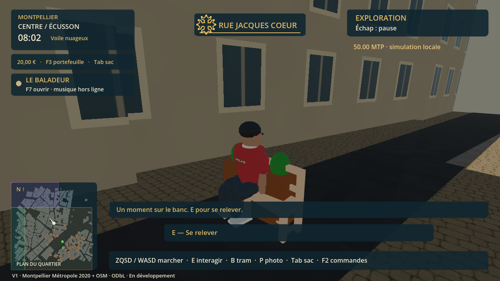
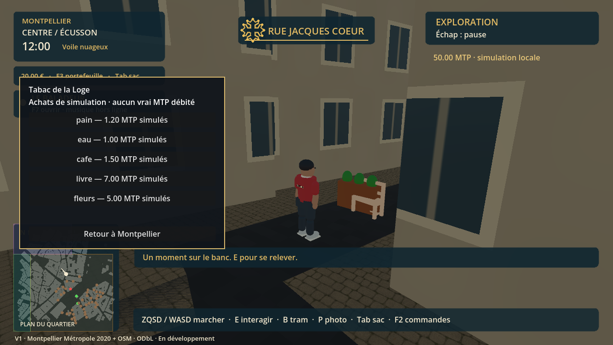
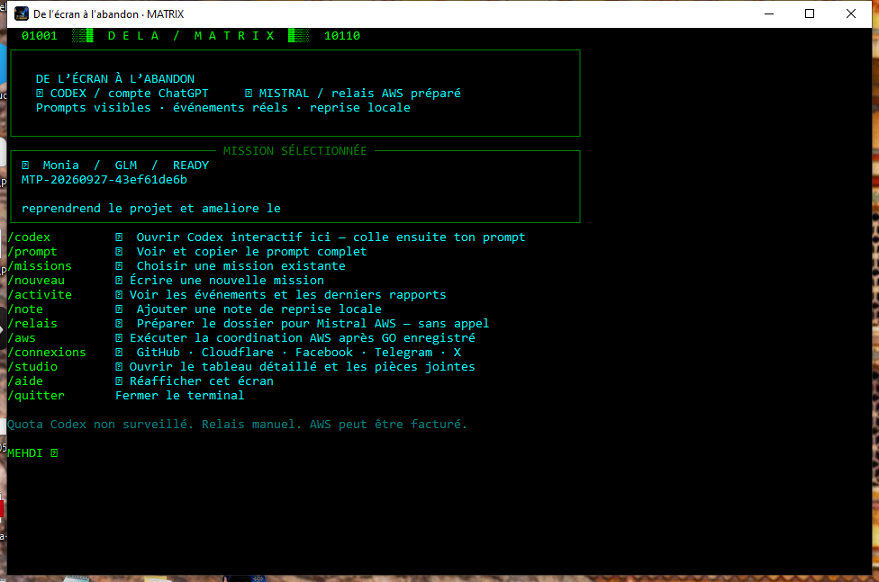
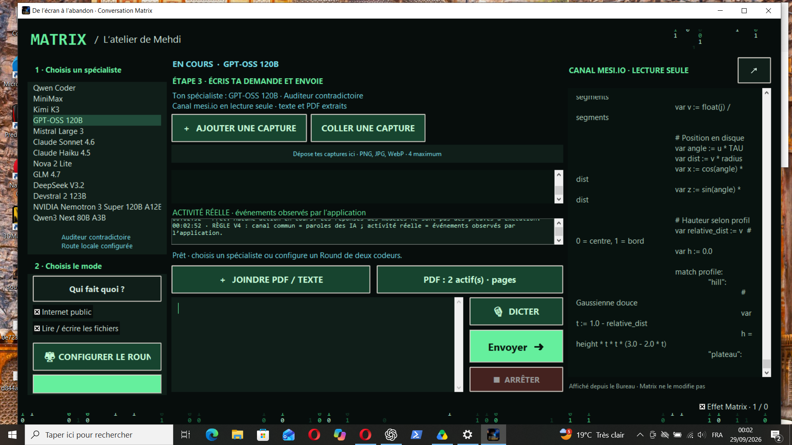

# Inside the game and MATRIX

Godot architecture, urban data, agents, AWS bridges and release evidence. Illustrated technical edition.

2026-09-30 · Mehdi Souissi / Codex

[Web](https://mtptoken.pages.dev/en/ai/engineering/) · [PDF](https://mtptoken.pages.dev/assets/engineering/en.pdf) · [Archives](https://mtptoken.pages.dev/en/ai/archives/)

## 01 · What exists, what remains to build

De l’écran à l’abandon is a Godot game in development, directed by Mehdi Souissi around his autobiographical work. MATRIX is the local workshop coordinating assistants around files; Frankenstein names the experiments connecting clients, models and tools. These are three distinct layers: creation, orchestration and request transport.

On 30 September 2026, VERSION_COURANTE.json identifies V1-20260930, approved “V” by Mehdi. The registry records 44 successful checks: 26 for interactions, missions and transport, and 18 for story and modes. These results cover that exact package. They do not validate subsequent agent changes or a V1.2 release.

Terrain remains flat, façades stylized, the tram network partial and the story mainly text based. The panoramic flight is fictional; in-game MTP is a local simulation. These interactions do not debit an account or make blockchain payments. Performance is not certified.



*Screenshot preserved with the V1 evidence, 30 September 2026: Place de la Comédie. Actual game image, with no rendering enhancement.*

## 02 · From creative intent to a testable mechanic

Design starts with source material: the manuscript, Mehdi’s decisions, continuation notes and release state. Missing autobiographical facts remain missing. An anonymous background NPC or driving exercise can serve gameplay without becoming a newly invented life event. This distinction must survive prompts, dialogue and mission briefs.

A request becomes an observable contract: starting conditions, player action, state change, feedback and success criterion. For a bench, for example, check approach, interaction, posture, exit and restoration of controls. “Add an immersive interaction” specifies none of these cases.

Production uses a focused batch: read the existing system, make the smallest coherent change, test the relevant path and record limitations. An agent’s word count is not an acceptance criterion. The bench must seat the character; the report can remain standing.

```text
SOURCE → player action → state transition → visible feedback
       → targeted check → evidence → producer validation
```



*V1 visual evidence: bench interaction. A screenshot illustrates one state; it does not prove every possible path.*

## 03 · Godot architecture and file responsibilities

The reference project is jeu-montpellier-arcade. project.godot starts world3d/start_menu.tscn; brand_menu.gd leads to world3d/main.tscn. world.gd coordinates the world. Files ending in .tscn describe scenes and resources, .gd files hold logic and .gdshader files define graphics processing. Old prototypes are preserved, not automatically promoted to current sources.

Files named official_buildings.gd, prototype_sector_stream_manager.gd and map_sector.gd separate building data, sector selection and local scene construction. A scene can reference a syntactically correct script whose properties are incompatible. Inspecting a single file is therefore insufficient to validate the project.

MATRIX’s Godot configuration points to travail-matrix-v1.1 as the shared continuation copy. The release registry still has a matrix_workspace field pointing to travail-matrix-v1: this discrepancy is reported rather than silently treated as evidence. The delivered reference remains livraison-v1-20260930.

```text
project.godot
└─ world3d/start_menu.tscn
   └─ brand_menu.gd → world3d/main.tscn
      ├─ world.gd
      ├─ prototype_sector_stream_manager.gd
      ├─ map_sector.gd
      └─ official_buildings.gd → data/official/manifest.json
```

## 04 · A city built from data, not a promise

The inspected official manifest lists 157,186 buildings and 6,205 sectors from Montpellier Métropole Bâtiments 3D 2020. These numbers describe the converted corpus, not objects rendered simultaneously or buildings with playable interiors. The manifest retains the source URL, archive SHA-256, bounds, origin and ODbL-1.0 licence information.

Provenance declares EPSG:2154 / NGF-IGN69. The vertical mode subtracts each building’s ZMIN for flat-world compatibility: it does not reconstruct terrain. The manifest also records scale_x ≈ 80,603.46 and scale_z = −111,320 around a longitude/latitude origin. These parameters belong to this conversion; they are not a universal geodetic projection recipe.

official_buildings.gd checks the binary signature 0x3146424f and reports missing or truncated sectors. Existing converted data is reused for code fixes. Downloading and rebuilding the city to change a button would be an excellent way to warm the PC without improving the button.

```text
manifest
  dataset / source_url / archive_sha256 / license
  origin_lon_lat / bounds / vertical_mode
  sectors[key] → converted sector data

Data provenance ≠ visual accuracy ≠ gameplay coverage
```

## 05 · Streaming, meshes and frame budget

Sector loading avoids treating the entire corpus as one monolithic scene. The official loader has a keyed cache and an eviction operation. Costs to distinguish include reading, decoding, mesh creation, collision generation and insertion into the scene. Moving file reads into the background alone does not remove resource-creation stalls.

To improve this pipeline, the proposed protocol measures each phase along the same route with cold and warm caches. Record median frame time, high percentiles, memory and loads. At 60 frames/s the theoretical budget is 16.67 ms per frame; this is a mathematical target, not a measurement of V1.

Culling, levels of detail and instancing are approaches documented by Godot [R2]. Their effectiveness depends on materials, objects and renderer. This review does not claim that MultiMesh, perfect occlusion or fully asynchronous streaming has been delivered without supporting evidence.

```text
Proposed measurement record / Fiche de mesure proposée
route, build_hash, renderer, resolution, cache_state
read_ms, decode_ms, mesh_ms, collision_ms, attach_ms
frame_p50_ms, frame_p95_ms, frame_p99_ms, peak_memory_mb
```

## 06 · Visual direction: coherence before accumulation

Visual quality is not an asset count. In this stylized city, players need to recognize volumes, read walkable surfaces and distinguish interactions from decoration. Materials, opening sizes, lighting and interface readability must be evaluated from the gameplay camera. The included screenshots show the existing rendering, including its limitations.

The tram art direction is specific: blue with white swallows, TaM line 1. Technical improvements must preserve that decision. The historical PDF named BETA 3 CLAQUE VISUELLE is a catalogue of resources and Godot ideas; its filename is neither a Beta 3 approval nor a list of installed extensions.

With a €0 additional budget, start with existing resources, native features and local code. A free resource may impose attribution, sharing or redistribution conditions. Check its licence and version before integration; the word “free” is not a licence importer.



*V1 screenshot: shop and interface. This dossier does not invent a photorealistic renderer from this image.*

## 07 · MATRIX: from console to coordination workstation

Historical screenshots show a launcher console followed by a conversation interface. The current matrix_pro.py uses Tkinter, background tasks and an event queue to coordinate display with network exchanges. The interface combines active project, specialists, conversations, streams and tools. The public site documents this Windows workshop; it does not expose an open terminal to the workstation.

Model roles are work instructions: coder, integrator, auditor, document reader. A role label does not prove a measured capability. The software still has to observe tool calls, files and results. The green theme makes it MATRIX; the logs make it traceable.

aws_chat.py handles conversations and calls; mission_chain.py manages relays; file_tools.py controls file operations; loop_guard.py detects repetition; godot_gate.py separates test requests from execution. This separation helps diagnose problems without conflating interface, network and game engine.



*Local MATRIX archive: early console interface. The displayed authorization rules belong to that historical stage.*

## 08 · Sequential relays and shared memory

For the game, specialists take successive turns on one shared copy. They can read previous results without launching concurrent writes to the same script. The opinion-comparison mode is distinct. Selecting several agents therefore does not necessarily mean several developers writing world.gd simultaneously.

mission_chain.py persists mission state and handoffs. A recommended successor is filtered against known aliases; otherwise selection order applies. State writes use a temporary file followed by replacement. Appending to coordination/mehdi.md is protected by a Windows lock.

Shared memory is not infinite: above 22,000 characters, context construction keeps the first 4,000 and last 18,000. A critical decision buried in the middle may therefore be absent from the next call. This makes short continuation notes, the version registry and explicit acceptance criteria valuable.

```text
selected agents → mission state → agent A → evidence
                                → agent B → evidence
                                → relay complete
                                → local Godot checks

response received ≠ change integrated ≠ release delivered
```

## 09 · Writing files without overwriting prior work

read_file returns text and its SHA-256. To replace an existing file, write_file requires expected_sha256; for a new file the marker is NEW. patch_file and patch_lines target a passage or line range. Missing or ambiguous text patches are rejected, with a backup before replacement.

This mechanism detects stale reads: if B changed the file after A read it, A must reread and reconcile. The hash does not evaluate code correctness. It only checks whether the expected content matches the content checked at the time of the operation.

Absolute paths are checked before and after resolution; only authorized roots on D: are usable. System and authentication directories and the V1 reference are protected. These are application guardrails, not proof of operating-system isolation. Text reads are paged in 300-line chunks with a 2 MB limit.

```text
// Illustrative tool exchange; no real credential
read_file({path: "D:/allowed/example.gd"})
  → {content: "...", sha256: "<observed hash>"}
patch_file({
  path: "D:/allowed/example.gd",
  expected_sha256: "<observed hash>",
  old_text: "exact old passage",
  new_text: "reviewable replacement"
})
  → written + backup + new hash, or explicit refusal
```

## 10 · AWS, LiteLLM and actual routes

MATRIX has routes through a local gateway and additional routes through a LiteLLM adapter. extra_models.py reads an alias catalogue, replaces the alias with target and supplies aws_region_name. The inspected adapter sets num_retries=0 and timeout=120. This describes that call, not a universal limit across all network layers.

A name in a list, a provider identifier and a model response are three different things. The local catalogue snapshot exported with this dossier retains name, target, region and test scope. Recorded tests for several routes are short text completions without tools or files. They therefore do not demonstrate game-development capability.

The local “GPT-6 Astra” entry is marked invocation_tested=false and access_denied_403. We publish it as unvalidated local configuration, not evidence that such a model is available on AWS. Provider names and availability must be checked in official catalogues. No paid inference invocation was needed to prepare this publication.

```text
MATRIX alias
  ├─ local gateway → provider adapter → AWS API
  └─ extra_models.py → LiteLLM completion
       target + region + messages + tool schemas
       → stream chunks → MATRIX events

UI label is not a provider attestation.
```

## 11 · Tool calling: protocol matters as much as prompts

In MATRIX’s client-side workflow, the model proposes a tool call and local code executes it. The history must preserve the identifier, arguments and result. AWS describes this principle in its tool documentation [R1]; exact support depends on API and model. A correct text answer does not guarantee a compatible tool cycle.

The GLM archives describe an adaptation failure between Responses, Chat Completions and Converse: a tool result no longer matched a valid call in the transmitted sequence. The V5 bridge mapped function_call to tool_calls and function_call_output to a tool-role message with tool_call_id. The structural contract had to be fixed before evaluating the model.

For a stream, accumulate argument fragments until a complete payload is available, then validate the schema before execution. Do not trigger a write for every displayed fragment. The example below explains the mapping; it is not a configuration ready to paste into every provider.

```text
Responses                     Chat Completions
function_call                 assistant.tool_calls[]
  call_id: "call_17"             id: "call_17"
  name: "read_file"              function.name
  arguments: "{...}"             function.arguments

function_call_output          role: "tool"
  call_id: "call_17"             tool_call_id: "call_17"
  output: "{...}"                content: "{...}"
```

## 12 · Frankenstein: failures that shaped the workshop

The Kimi and Mistral documents preserve early local routes, including ports 4001 and 4002. These are historical references, not ports to expose to the internet. Incidents included inconsistent local authentication, rejected MCP tool names and shell syntax differences. Minimal tests separated connectivity, text generation and tools.

The GPT-OSS archive describes isolating a bridge on 4010 after routing problems. One microtest recorded tokens without useful output text. It proved inference activity, not a deliverable. The GLM chronicle preserves successive bridge variants up to 4025: it documents a diagnostic process, without certifying their current use.

The useful rule: change one layer at a time and preserve the minimal request, error and outcome. HTTP 400 points toward format or parameters; 403 toward access; 429 toward limits or availability. None of these codes alone demonstrates that an agent “does not want to work”.

```text
Diagnostic ladder / Échelle de diagnostic
1. local process listening
2. correct configured route
3. minimal text response
4. one read-only tool round trip
5. controlled file change + observed hash
6. project import + targeted gameplay check
```

## 13 · Measuring contribution and stopping loops

A pass should be described through evidence: tools executed, files created or changed, hashes, test results and limitations. “I am done” is a claim. A SHA-256 establishes file identity, not quality. A successful import establishes more, but does not replace interaction testing or running the delivered package.

loop_guard.py stops four repetitions of the same normalized long sentence, three identical errors for a tool and path, or five identical reads with the same result without a write. It keeps a 24,000-character window. A reported write resets its counters. These are deterministic heuristics with possible false positives, not an intelligence measure.

A useful correction gives a bounded, verifiable task and asks for the expected evidence. Agents blocked by a provider are distinguished from agents producing only a plan. The historical “Auditer les mythos” button keeps its humour; the report must keep its evidence.

```text
Evidence ladder / Niveaux de preuve
0 claim
1 observed tool result
2 changed file + hash
3 successful import
4 targeted behaviour verified
5 exported package checked
6 producer validation of that exact package
```

## 14 · Automatic Godot: request, queue, execution, result

Mehdi authorized local Godot checks without a new approval for each call. In the inspected configuration, godot-access.json enables import and smoke checks on travail-matrix-v1.1 after the relay finishes. godot_gate.py records requests; godot_authorized_worker.py processes them in the background and records results.

Deduplication avoids needlessly repeating a mode within a batch. Import uses --editor --quit; the short startup uses --quit-after 120. That argument counts iterations, not 120 seconds. The worker separately enforces its timeout. Godot documents its CLI options in [R3].

“Automatically queued” does not mean “passed”. Read the final log, script errors, exit code and any timeout. This authorization does not automatically turn testing into export, publication or a new release. The engine queue does not need a model subscription to compile a script.

```text
request → deduplicate → wait for relay → claim job
        → run local Godot → log + result → shared notice

queued / running / passed / failed / timed out

Example CLI pattern (adapt paths; not an export):
Godot.exe --headless --path <working-copy> --editor --quit
Godot.exe --headless --path <working-copy> --quit-after 120
```

## 15 · Exporting, testing and naming a release

A release must connect sources, artifacts, tests and registry. The .exe starts the runtime; the .pck contains game resources. Testing source files and then shipping an old package would create false confidence. Keep the path and hash of both artifacts actually delivered.

The V1 registry records an 826,546,456-byte package and the hashes reproduced below. This documentation quotes them from the registry; it does not claim the 44 checks were rerun while writing it. Previous releases are retained. At the next verified release, state, registry, continuation notes and launcher must be updated together.

A smoke test reduces startup risk without covering saves, collisions, long sessions or performance. A panoramic-flight screenshot proves a displayed state at that moment, not a complete airport. These limits make the report actionable by identifying what to test next.

```text
V1-20260930 · SHA-256 (release registry)
PCK
3963c6b91ab4db67f637fbb388fee62fee544677150f56377fddba5d22142b5b
EXE
62e5c76b560e3b09670f3603d670ae02610850d9dc3a8e1a7710b75dbfd9e5aa
```


*V1 evidence: fictional panoramic flight. This mode is not a complete aviation simulation.*

## 16 · Documents, storage and budget

Document tools extract PDF text locally; scans use local OCR. OCR can corrupt code, names and numbers: inspect the original page for critical decisions. Extracted text sent to a model then leaves the workstation for that provider. Local extraction and entirely local processing are not synonyms.

Histories, streams and backups need a retention policy. A move to D: should be verified through complete copying, hashes and destination checks before removing originals. Active logs and open databases need separate handling. A junction can preserve an old path, but it does not change application access checks.

The project constraint is €0 additional spending: reuse existing data, installed tools and compatible resources. A cloud model may still incur charges even when a local tool is free. Avoiding blind retries, bulk rereads and long streams without progress also saves diagnostic time.

```text
Document → local extraction/OCR → bounded text
         → selected provider only when called

Archive → public copy → sensitive-value redaction
        → page count + SHA-256 → downloadable manifest
```

## 17 · Publishing reproducible documentation

The site is generated from website/portal in MontpellierECU. Static files are copied to site/, then modules produce pages and the sitemap. This edition adds shared bilingual editorial source, web rendering, PDF rendering and an archive library. Text changes can therefore be reviewed in Git rather than only in a binary PDF.

The nine supplied documents remain dated archives. The public manifest records original name, published name, page count and the hash of the published copy. When an authentication value is masked, the copy is explicitly marked as redacted; local originals are retained. Gold borders frame screenshots without disguising the game’s rendering.

Publication checks cover FR/EN links, downloads, mobile pages, browser errors and hashes of served PDFs. Git push and Cloudflare deployment are separate operations: success in one does not prove success in the other.

```text
engineering-data.cjs
  ├─ web pages FR / EN
  ├─ Markdown docs FR / EN
  └─ print renderer → technical PDFs FR / EN

static/assets/ia-archives/ + manifest.json
  → build → local verification → Git → Cloudflare
  → remote download verification
```

## 18 · Next work and limits of this study

The next game improvement should start from the shared copy, select a reproducible issue, implement a fix and verify behaviour. For rendering: measure before optimizing. For story: return to the facts. For MATRIX: keep tool protocols, states and evidence consistent. For V1.2: wait for a tested package and explicit validation.

This study is a dated technical reading of local files and archives, supported by official references. It is neither a comparative model benchmark, a comprehensive security audit nor a complete reproduction of private infrastructure. Protocol examples are educational; historical screenshots may show behaviours replaced since.

Publication makes the method inspectable: named files, a hash snapshot, a local catalogue restricted to public fields and declared limitations. The producer retains creative direction. Agents earn their place through useful, verified changes. Coffee still has no tool_call function.



*MATRIX archive, 29 September 2026: conversation interface and activity log. Displayed proposals are not evidence of implementation.*

## References / Références

- [R1 — Amazon Bedrock · Tool use](https://docs.aws.amazon.com/bedrock/latest/userguide/tool-use.html)
- [R2 — Godot · Optimizing 3D performance](https://docs.godotengine.org/en/stable/tutorials/performance/optimizing_3d_performance.html)
- [R3 — Godot · Command line tutorial](https://docs.godotengine.org/en/stable/tutorials/editor/command_line_tutorial.html)
- [R4 — LiteLLM · Bedrock provider](https://docs.litellm.ai/docs/providers/bedrock)
- [D1 — Montpellier Métropole · Bâtiments 3D 2020 (archive source / source archive)](https://data.montpellier3m.fr/sites/default/files/ressources/MMM_MMM_Bat3D.zip)

[Model routes / Routes des modèles](../website/portal/static/assets/engineering/model-routes.json) · [Source hashes / Empreintes](../website/portal/static/assets/engineering/source-snapshot.json)
